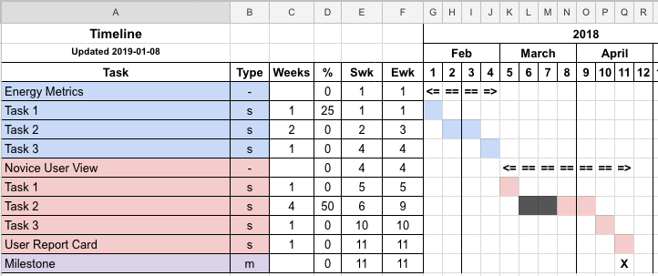

# Simple Gantt-Style Chart in Google Sheets

After fighting with MS Project I decided a simple Gantt-style chart generator suitable for
generating high-level timelines was needed.  This tool uses Google Sheets and a simple set of
JavaScript functions to generate a timeline based on a list of tasks, types, durations, and percent
complete.

Features:
- Define tasks, subtasks, parent tasks, and milestones
- Task types are specified using:
    - "-" for parent tasks
    - "s" for subtasks
    - "m" for milestones
    - Simple tasks have no type
- Tasks and subtasks include duration and percent complete (milestones have no duration)
- Parent tasks are meant as containers for subtasks and are displayed to enclose subtasks
- Task bars are drawn using the background color of the task definition (1st column)
- The start and end weeks are calculated sequentially based on the end of the previous task and
  the task duration. To start a task on a specific week, simply overwrite the cell fomula
    - The default start week formula is: `=IF(0=$C6,$F5,$F5+1)`
    - The default end week formula is: `=IF(0=$C6, $E6, $E6+$C6-1)`

See the `Timeline Template.xlsx` file exported form Google Sheets for an example. Note that the `Swk` and `Ewk` columns can be hidden.

## Installing

1. Create a Google Sheet based on the sample workbook.
2. Open the Script Editor (Tools -> Script Editor).
3. Create a `Code.gs` file and paste the JavaScript into it.
4. Re-load the Google Sheet, you should now see a "Timeline" menu item. Note that you may need to
   grant permission to the script.
5. Select the area where the timeline will be generated. This is the area to the right of the task
   descriptions and below the week numbers.
6. Select Timeline -> Color Timeline.
